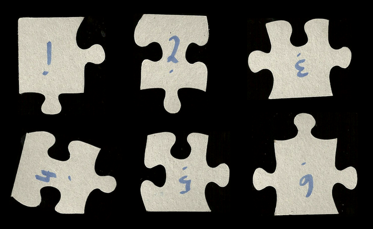

PuzzleSolver
============

This is a program that uses computer vision techniques to solve jigsaw puzzles using the shapes of the edges. 
It can be used to solve puzzles from scratch, or help solve partially completed puzzles. It works best with 
fully-interlocking puzzles that have pieces of approximately the same size.

PuzzleSolver is a hybrid command-line/GUI application.  Input parameters are specified on the command line. Status and 
results are written to the console and to various files in the output directory.  There are times when PuzzleSolver 
will pupup a GUI window -- namely when verifying contours found in the input images, when allowing the user to manually 
adjust the corner locations of a piece, and in guided solution mode to present suggested piece matches.  If a solution can 
be found, then an image of the solved puzzle is shown in a GUI window.


## Contents

- [Installation](#installing-opencv)
  - [Mac OSX](#osx)
  - [Linux](#linux)
- [Solve a built-in demo puzzle](#solving-a-demo-puzzle)
- [Solve your own puzzle](#solving-your-own-puzzle)
- [Command line options](#command-line-options-intro)
- [Solution Modes](#solution-modes)
- [Finishing partially completed puzzles](#finishing-partially-completed-puzzles)
- [How It Works](#how-puzzlesolver-works)  


# Installing OpenCV

OpenCV is required to run PuzzleSolver. This version compiles with OpenCV version 2, 3, or 4. Here is how I have done it on 3 different computers...

## OSX 
Tested on High Sierra (10.3.x) and Mojave (10.4.x) with OpenCV 4.0.1
```
### Install Homebrew if you haven't already. Visit https://brew.sh and install it

### Install opencv
brew install opencv libomp
```

### Running on OSX
For some reason on High Sierra I have to set DYLD_FALLBACK_LIBRARY_PATH or PuzzleSolver fails to execute due to unresolved library issues.  This issue went away after I upgraded to Mojave.
```
DYLD_FALLBACK_LIBRARY_PATH=/usr/local/opt/lib ./PuzzleSolver ...
```
## Linux
Tested on Ubuntu 18.04
### Via apt-get
Installs OpenCV 3.2 as of Jan 2019

```
sudo apt-get install libopencv-dev
```

### Manual install

Installed OpenCV 3.4.4 following the instructions here: https://www.pyimagesearch.com/2018/05/28/ubuntu-18-04-how-to-install-opencv/


### On ChromeOS, Linux (Beta)

Installs OpenCV 2.4 as of April 2019
```
sudo apt-get install libopencv-dev
```

# Compiling PuzzleSolver

On Linux or Mac run this from the PuzzleSolver/Src directory:
```
./build.sh
```

The result will be an executable called PuzzleSolver.  Run it with the `--help` option and the usage information will be written to the console.

## Source-level debugging
The default compiler optimizations can make it difficult to use source-level debugging.  To disable optimizatons, execute the following command.  PuzzleSolver will run noticably slower afterwards.
```
./configure CXXOPTS="-g -O0" && make clean && make
```
To re-enable the optimizations, do this:
```
./configure && make clean && make
```

# Using PuzzleSolver


## Solving a demo puzzle
PuzzleSolver includes scans for several demo puzzles.  A list of the demos appears at the end of the usage output when 
`-h` or `--help` is included in the command line options.  To run a demo, use the `--demo` option and give the demo puzzle name.
```
./PuzzleSolver --demo toy-story-color
```
When PuzzleSolver is done solving the puzzle, a popup window appears showing the completed puzzle.  The output directory for the demos is /tmp/${demo-puzzle--name}

## Solving your own puzzle

PuzzleSolver can be used on all pieces of a puzzle, or on just the loose pieces of a partially completed puzzle.

### Process Overview
- Number the back of the loose puzzle pieces in sequential order starting from "1". 
- Use a flatbed scanner and scan the backs of the pieces.  In each scan, you can include as many pieces as will fit such 
  that they don't touch each other or the edges of the scanning area.  Ideally, the background of the scanned images 
  should be black.  To achieve this, scan with the scanner lid open and the room lights off. Repeat until all pieces have 
  been scanned.  To make the process easier later, keep the pieces in numbered order after scanning.
- Place the images from the scanner in a directory by themselves (this will be referred to as the input directory).
- Run PuzzleSolver passing the pathname of the input directory and an output directory.  The output directory will be 
  created if it does not exist.  Adjust the command line options until all pieces are recognized and all warnings regarding 
  the quality of the piece corners have been mitigated (more on these subjects below)
- Run PuzzleSover again with the `--solve` or `--guided` option.  The `--solve` option invokes automatic solution mode, 
  good for solving complete puzzles with around 100 pieces or less.  The `--guided` option invokes an interactive mode 
  good for solving puzzles with a large number of pieces, or for solving partially completed puzzles.  For partially completed
  puzzles, PuzzleSolver will help you fit the loose pieces together via `--guided` solution mode.

**Example input image:**



## Command line options intro

More detail on command line options is given in the [How PuzzleSolver Works](#how-puzzlesolver-works) section, below.

Usage synopsis:

```./PuzzleSolver <input directory> <output directory> [options]```

The input directory must only contain the scanned images of your puzzle pieces.  The output directory will be created if it doesn't exist.

Try starting with options `--estimated-piece-size 100` and `--verify-contours`.  When the contour window pops up, press 
the 't' key on your keyboard to toggle between viewing the numbered contours and the original color image.  Press the 'n' 
key to advance to the next image.  If contours do not show for some pieces, then try again with a lower estimated piece 
size value.  If too many contours are shown, then increase the estimated piece size.  If the assigned contour numbers are 
different compared to the numbers shown in the input images, then read up on the `--order` option, below, or re-scan 
the pieces after adjusting their layout on the scanner bed.

| Contour verification window |
| :--- |
|  <br> With focus on this window, press the 't' key to toggle between viewing the contours <br>and the original input image. Press the 'n' key to advance to the contours of the next input image.  |


**Corner quality warnings**

If you get warnings about poor corners quality, try lowering the estimated piece size.  If that doesn't help, then try using 
a lower `--threshold` value.  The `--corners-blocksize` value might also need to be reduced, especially for smaller pieces or if scanned with lower DPIs. 
For persistent corner quality issues, use `--adjust-corners` to trigger a popup GUI window for each piece with poorly located corners. 
This window allows the corner locations to be adjusted -- click and drag the red circles until they are each positioned 
over a corner, then press the 'n' key to dismiss the window and advance to the next problematic piece, if any.  If no edits 
are necessary, press the 'n' key.  Manual adjustments are persisted in data files in the output directory so that they don't 
have to be re-adjusted when re-running PuzzleSolver.

The rendering scale of this window can be adjusted using the -/+ keys, or you can use the `--scale` option to set it for all popup windows.
Toggle between the color and black and white version of the piece with the 'c' key. 

| Corners before adjustment | Corners after adjustment |
| :--- | :--- |
|  |  |

## Solution Modes

When you are ready for PuzzleSolver to solve the puzzle, rerun with the same command line options as before, but add either the 
`--solve` or `--guided` option.  PuzzleSolver loads and processes the input images as it did before, but then advances into 
solution mode by first computing a score for every possible edge-edge matchup.  The computed scores are used to determine 
how to fit peices together when finding the overall solution.  


### Auto Solution Mode
In automatic mode (`--solve`), PuzzleSolver will attempt to solve the entire puzzle without any further input.  This 
works for the demos, and is likely to work for entire puzzles with low piece counts and relatively large phyiscal piece 
sizes.  Automatic solution mode, when successful, will show you an image of the completed puzzle.  The solution image 
file is also saved to the output directory as `solution.png`, and the console output is appended to `solution.log`.

### Guided Solution Mode
In guided solution mode (`--guided`) you will be prompted via a popup GUI window to match pieces together.  Find the two 
pieces shown and check to see if they are a proper match -- if so, press the 'y' key on your keyboard, otherwise press 
the 'n' key.  For those pieces that fit to form a proper match, leave them connected.   With each 'y' or 'n' keypress, 
the GUI window will disappear and re-appear to prompt you to check another proposed match. Notice that the piece depicted 
on the left side of this window always belongs to the matched group, and the one on the  right is from the set of unmatched 
pieces. The 'y' and 'n' answers are remembered in a data file in the output directory.  PuzzleSolver picks up from where it 
left off as long as it is invoked with the same command line parameters.

In guided mode, PuzzleSolver attempts to find the best possible match of a new piece to the group of matched pieces you are currently 
working on.  It does this by finding the lowest edge-edge match score which includes an exterior edge in the group. The process 
is not perfect, especially for puzzles with small piece sizes, and often the suggested matches aren't the correct fit.  
When a piece does fit, leave it attached and press the 'y' key.

The rendering scale of this window can be adjusted using the -/+ keys, or you can use the `--scale` option to set it for all popup windows.

Press the 'h' key, and a list of keystroke commands with descriptions will be displayed on the console. Focus must be on 
the GUI window to trigger the keystroke commands.

PuzzleSolver saves/loads data to/from files in the output directory such that it will pick up from where it left off 
given the same set of input images and command line options. In other words, it is not necessary to solve the entire puzzle 
in this mode in a single sitting.

| Guided match prompt window |
| :--- |
|  |

## Finishing partially completed puzzles

PuzzleSolver can be used to help finish partially completed puzzles, including cases where there are more than one 
uncompleted sections.  To do this, number and scan only the loose pieces.  Use guided solution mode.

_Example work-in-progress on an unfinished section (i.e., matched group)..._


_Front side of the same matched set of pieces..._


#### Starting a new matched group

Suppose you are using PuzzleSolver to help complete a partially completed puzzle that has two separate unfinished sections. 
You've scanned the loose pieces and in guided mode have performed enough successful matches that one of the unfinished 
sections is now solved, but PuzzleSolver keeps prompting you to match loose pieces to the edges of the already completed section.
PuzzleSolver needs to be told to work on the other section instead.  To do this, press 'w' key while the guided match 
window is in focus.  The window will disappear and an input prompt on the console will ask for a piece number to work on.
Enter the piece number of a loose piece and the guided match window will reappear prompting you with a match for that piece. 
You will have to return focus to the guided match window in order to proceed, but from this point forward you will be 
prompted to match and build a new group of pieces.

Alternatively, you can restart PuzzleSolver with the `--work-on` option and provide the piece number.

It is possible to switch back to working on a previous group by entering the piece number of any piece in the group you 
want to work on, either via the 'w' key or `--work-on` option.

#### Setting boundary edges

This concept is hard to explain, so here are some definitions which should help:

"original finished section" - is comprised of pieces that were fit together prior to numbering and scanning any loose pieces.

"matched group" - is comprised of the numbered, matched and fitted pieces in any uncompleted section that PuzzleSolver is helping to solve.

At some point you'll realize that PuzzleSolver is suggesting matches for pieces in the current matched group which are 
known to match pieces in the original finished section of the puzzle.   These suggested matches are a waste of time.
To prevent PuzzleSolver from suggesting a match to the right edge of the left piece currently shown in the guided match 
window, press the 'b' key.  The decision to mark an edge as a "boundary edge" is remembered (saved) in a data file in
the output directory. 


# How PuzzleSolver works
This section introduces the internals of PuzzleSolver and its command line options. 
- The program begins by scanning the input directory for image files, sorts them by name into alphabetical order, and then loads them.
- For each image it finds, it identifies puzzle pieces within the image via a series of steps...
  - The image is filtered to reduce noise. By default, OpenCV's medianBlur() function is used.  Use the `--median-blur-ksize` command line option to override the default ksize value for the medianBlur() call.  Alternatively, a built-in filter function can be used instead of medianBlur() via the `--filter` option. 
  - A two color, black-and-white version of the image is created by first converting the image to greyscale, and then tresholding the image.  The threshold value can be controlled via the `--threshold` option.
  - OpenCV's findContours() method is used to find the piece contours in the black and white image.  Contours with a width or height less than the estimated piece size are assumed to be from image noise and are rejected.  Use `--estimated-piece-size` to override the default value.  This value is also important when detecting the piece corners later on.
  - The piece contours are sorted and numbered in the order they appear in the input image.  By understanding how PuzzleSolver numbers the pieces and by carefully arranging the numbered pieces on the glass when scanning, the piece numbers used in PuzzleSolver can be made to match those written on the peices.  The default numbering order is "left to right, top to bottom" (`lrtb`) within the image, as in the order of written words on a page.  The `--order` option can be used to change the default order value of `lrtb`. Eight different ordering options are available: lrtb, rltb, lrbt, rlbt, tblr, tbrl, btlr, and btrl.  To see what PuzzleSolver is doing here, use the `--verify-contours` option and the numbered contours will be displayed in a popup GUI window.  Press the 't' key when focus is on this window to toggle between the contours and the original color image.  Press the 'n' key to advance to the contours of the next image.
- For each puzzle piece that is found...
   - Small color and black and white images representing the piece are extracted from the the input image and associated with the piece data.
   - The locations of the piece corners are identified via an iterative process that calls OpenCV's goodFeaturesToTrack() function on the piece's black and white image.  Corner cobminations are rejected if the distance between corners is shorter than the value given by `--estimated-piece-size`.  The `blockSize` parameter passed to goodFeaturesToTrack() can be controlled via the `--corners-blocksize` option.
   - A check on the quality of the identified corner locations is performed by comparing the corners found to those of a rectangle.  The result is a 'corners quality' metric for which the value is higher for a piece with corner locations less like those of a rectangle, and lower for a piece where the corner locations are more like the corners of a rectangle.  If the value for a piece exceeds the `--corners-quality` option value, then a warning is reported to the console.  If a large number of warnings is issued, then the estimated piece size is probably set too high and should be lowered.  If warnings persist, then the corner locations for these pieces can be viewed and manually adjusted in a popup GUI window by re-running PuzzleSolver with the `--adjust-corners` option.  See below for more details on the corner adjustment GUI.
   - The piece contour is divided into four edge contours at the corner locations.  A copy of each edge contour is "normalized" -- i.e., translated and rotated so that one end is positioned at the origin and the other end is positioned above it on the y-axis.  This allows for easy automatic classification and comparison of edges within the software.
   - The shape of each edge is analysed and classified into one of three types: OUTER_EDGE, TAB, or HOLE. 
 - If you have not directed PuzzleSolver to proceed to the solution phase via `--solve`, `--guided`, or `--demo`, processing stop here and PuzzleSolver exits.
 - PuzzleSolver computes scores for each possible edge-edge combination.  Lower scores indicate a better match.  Impossible matches such as a TAB edge matched to another TAB edge are given the highest possible score.  Otherwise for every point in "this" contour the distances to the closest point in "that" contour are summed up and then added to the square of the difference in the distances between the two edge endpoints.
 - The edge-edge combinations and thier scores are sorted into ascending order by the score values.
 - In automatic mode, a solution is attempted by iterating down the sorted list, matching the two edges of each entry 
   and rejecting the match if it results in an impossible physical arrangement of pieces such as overlaps, etc.  If the 
   solution were to be visualized over time, it would appear as if the pieces randomly coalesce until all pieces have 
   been matched into a single group of pieces.  The solution is attempted in a single pass down the sorted edge-edge match list, and
   not by trying to reduce the overall sum of all matched edge scores. 
 - Guided solution mode is similar except that the the human operator participates in accepting and rejecting possible 
   matches, and the number of matched sets is intentionally kept to a minimum for the sake of the user's sanity.  In this mode, additional checks
   are performed prior to suggesting a match where the new piece would fit against more than just the other edge from the edge-edge match score list entry.
   - Adjacent edge matches are checked for impossible fits, such as TAB to TAB or HOLE to HOLE matches, and rejected as appropriate.  
   - The adjacent edge-edge score values can also result in a rejected match when they exceed certain thresholds.
      - If an adjacent edge match score has a corner-corner distance difference component that exceeds the value configured 
        with `--cscore-limit`, then the match is rejected.
      - If an adjacent edge match score has a point-point distance sum component that exceeds the value configured with 
        `--escore-limit`, then the match is rejected.


